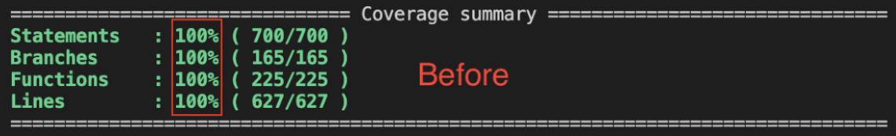
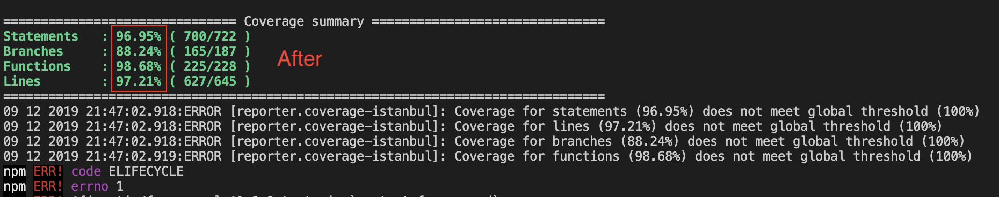

<h1 align="center">

[](#)

[karma-sabarivka-reporter](https://github.com/kopach/karma-sabarivka-reporter)

</h1>

<div align="center">

[](https://codecov.io/gh/kopach/karma-sabarivka-reporter)
[](https://greenkeeper.io/)
[](https://travis-ci.com/kopach/karma-sabarivka-reporter/branches)
[](https://snyk.io/test/github/kopach/karma-sabarivka-reporter)

[](https://www.npmjs.com/package/karma-sabarivka-reporter)

</div>

⭐️ Please, star me on GitHub — it helps!

[karma-sabarivka-reporter](https://github.com/kopach/karma-sabarivka-reporter) – is a Karma plugin which adds untested files to [istanbul](https://github.com/gotwarlost/istanbul) coverage statistic

<h1 align="center">





</h1>

## 🧬 Table of Contents

- [❓ Why?](#-why-)
- [✨ Features](#-features-)
- [💾 Install](#-install-)
- [👽 API](#-api-)
- [🔨 Usage](#-usage-)
- [📄 License](#-license-)

## ❓ Why? [🔝](#-table-of-contents)

If your project has single entry point for your test files (e.g. `test.(ts|js)` file which gathers all `*.spec.(ts|js))`) - you're probably facing an issue with "fake" test coverage. To have a real picture of test coverage all files with source code should be imported directly into `*.spec.(ts|js))` files. Files with source code, which were not imported in any `*.spec.(ts|js))` files will not be shown in coverage report at all, which creates higher coverage result than it is in reality.

This plugin will be at least useful for all Angular 2-8 projects generated using angular-cli.

This karma plugin attempts to fix described issue by going through all of the source files and including them explicitly into coverage result.

Plugin works with both: TypeScript (`*.ts`) and JavaScript (`*.js`) files

## ✨ Features [🔝](#-table-of-contents)

- Both JavaScript `*.js` and TypeScript `*.ts` files support
- Multiple patterns
- Negated patterns: ['foo*', '!foobar']

## 💾 Install [🔝](#-table-of-contents)

With [npm](https://npmjs.org/) installed, run

```bash
npm install --save-dev karma-sabarivka-reporter
```

## 👽 API [🔝](#-table-of-contents)

`@param {string[] | string} coverageReporter.include` - Glob pattern, `string` or `array of strings`. Files which should be included into the coverage result.

## 🔨 Usage [🔝](#-table-of-contents)

Update `karma.conf.js`

### `include` as array of strings [🔝](#-table-of-contents)

```JavaScript
reporters: [
  // ...
  'sabarivka'
  // ...
],
coverageReporter: {
  include: [
      // Specify include pattern(s) first
      'src/**/*.(ts|js)',
      // Then specify "do not include" patterns (note `!` sign on the beginning of each statement)
      '!src/main.(ts|js)',
      '!src/**/*.spec.(ts|js)',
      '!src/**/*.module.(ts|js)',
      '!src/**/environment*.(ts|js)'
  ]
},
```

Same result may be achieved with more complex one line glob pattern

### `include` as string [🔝](#-table-of-contents)

```JavaScript
reporters: [
  // ...
  'sabarivka'
  // ...
],
coverageReporter: {
    include: 'src/**/!(*.spec|*.module|environment*|main).(ts|js)',
},
```

### karma `plugins` section [🔝](#-table-of-contents)

If your karma config has `plugins` section, add also `karma-sabarivka-reporter` there. Otherwise — no action is required.

Karma's documentation:
> By default, Karma loads all sibling NPM modules which have a name starting with karma-\*.\
You can also explicitly list plugins you want to load via the plugins configuration setting. The configuration value can either be a string (module name), which will be required by Karma, or an object (inlined plugin).

[See here more info on how karma plugins loading works](https://karma-runner.github.io/4.0/config/plugins.html)

```JavaScript
plugins: [
  // ...
  require('karma-sabarivka-reporter'),
  // ...
],
```

## 📄 License [🔝](#-table-of-contents)

This software is licensed under the [MIT](https://github.com/kopach/karma-sabarivka-reporter/blob/master/LICENSE)
